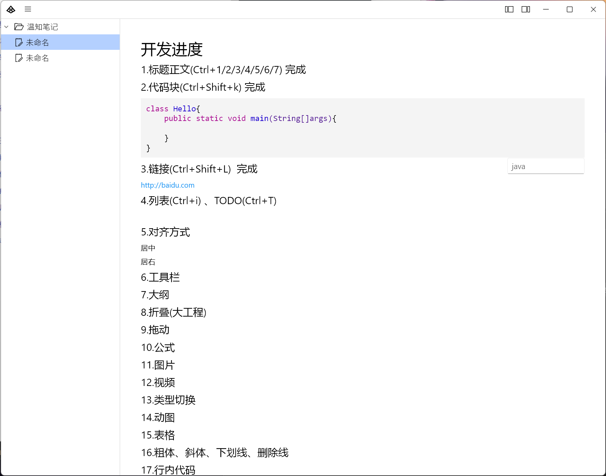

# WenNote
温知笔记
## 截图

## 开发进度如下
### 1.标题正文(Ctrl+1/2/3/4/5/6/7) 完成

### 2.代码块(Ctrl+Shift+k) 完成

### 3.链接(Ctrl+Shift+L)  完成

### 4.列表(Ctrl+i) 、TODO(Ctrl+T)

### 5.对齐方式

居中

居右

### 6.工具栏

### 7.大纲

### 8.折叠(大工程)

### 9.拖动

### 10.公式

### 11.图片

### 12.视频

### 13.类型切换

### 14.动图

### 15.表格

### 16.粗体、斜体、下划线、删除线

### 17.行内代码

### 18.字体美化

### 19.滚动条

### 20.输入法拼音显示

### 21.文件夹/文件

### 22.图片/文件/文件夹拖动

### 23.状态栏

### 24.context菜单

### 25.系统托盘

### 26.撤销栈优化

### 27.数据导入导出

### 28.导出导入markdown、pdf、png

### 29.数据同步

### 30.文档分享

### 31.斜杠下拉

### 32.图片编辑预览

### 33.数据加密

### 34.主题：外观模式、界面布局

### 35.contextmenu美化

### 35.搜索

### 36.手机端适配

### 37.阅读模式

### 38.中文双击选择中文词汇

### 39.推广html

### 40.推广帖子

### 41.推广视频

### 42.点击block结尾处创建新block

### 43.空白block选择时显示2像素

### 44.删除block

### 45.多标签