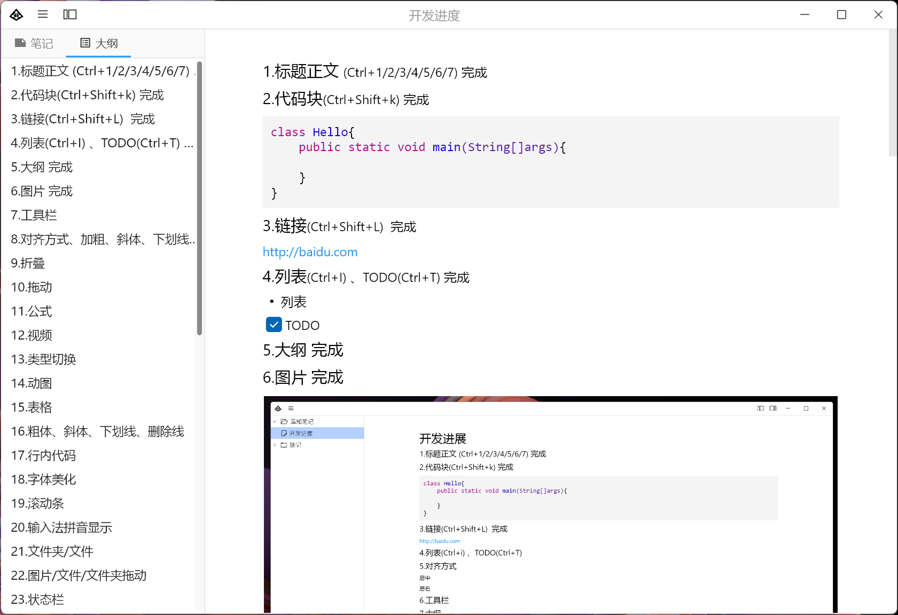

# WenNote
温知笔记
  
## 介绍
大家好，我是 lyming。

不好意思，作为开发者，我来卷一下笔记软件。

为啥？

为了学习积累。

温故而知新，可以为师矣。

所以取名温知笔记，准备用咖啡作为logo，就是想送给大家的温暖小咖啡，我希望大家也给我送点咖啡。

我心目中的笔记是简约、直观、清爽；支持本地存储；支持代码块、图片、文件；搜索快。

然而我很难找到这种笔记 App。

大部分这种功能实现的，基本是 Markdown。

虽然我是程序员，但我不喜欢 Markdown 式写笔记，我喜欢傻瓜式写，写什么就看到什么，插入图片就是图片，插入代码就是代码。

我可能有洁癖。

就是喜欢简单。

就是喜欢界面空白多。

就是喜欢黑白。

就是想要较小的体积。

就是想要单篇笔记就支持1万以上文字流畅编辑，本软件支持100万。

就是想要打开就能编辑。

就是想要图片、文件拖拽到工作聊天窗口。

就是想要记忆曲线帮助复习。

就是想要自己管理笔记。

目前找到的笔记软件，要么性能不好，要么就是 Markdown，要么就是不支持代码块，要么就是不支持离线保存。

所以我就决定自己开发一款笔记软件。

开发了一段时间了(晚上下班后熬夜开发)。

终于在坚持不懈的努力之下，初步完成了我心目中的笔记 App，当然还差很多功能需要实现。

今天怀着激动的心情，带给大家。

我希望，此 App 能给大家带来价值，也希望给自己带来价值。

感谢！

## 开发进展

本项目单人开发，用爱发电，乱序随缘展开进度。

### 1.标题正文(Ctrl+1/2/3/4/5/6/7) 完成

### 2.代码块(Ctrl+Shift+k) 完成

### 3.链接(Ctrl+Shift+L)  完成

### 4.列表(Ctrl+i) 、TODO(Ctrl+T)

### 5.对齐方式

居中

居右

### 6.工具栏

### 7.大纲

### 8.折叠(大工程)

### 9.拖动

### 10.公式

### 11.图片 完成

### 12.视频

### 13.类型切换

### 14.动图

### 15.表格

### 16.粗体、斜体、下划线、删除线

### 17.行内代码

### 18.字体美化

### 19.滚动条

### 20.输入法拼音显示

### 21.文件夹/文件

### 22.图片/文件/文件夹拖动

### 23.状态栏

### 24.context菜单

### 25.系统托盘

### 26.撤销栈优化

### 27.数据导入导出

### 28.导出导入markdown、pdf、png

### 29.数据同步

### 30.文档分享

### 31.斜杠下拉

### 32.图片编辑预览

### 33.数据加密

### 34.主题：外观模式、界面布局

### 35.contextmenu美化

### 35.搜索

### 36.手机端适配

### 37.阅读模式

### 38.中文双击选择中文词汇

### 39.推广html

### 40.推广帖子

### 41.推广视频

### 42.点击block结尾处创建新block

### 43.空白block选择时显示2像素

### 44.删除block

### 45.多标签